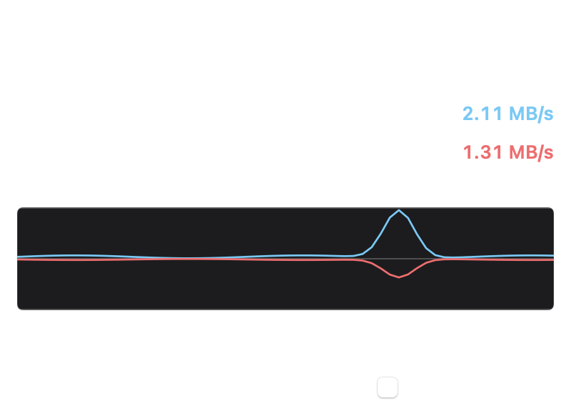

# MacNetSpeed — Free macOS Menu Bar Network Speed Monitor

**MacNetSpeed** is a free, lightweight **macOS menu bar network speed monitor** that shows live **download and upload speed**, **data received / data sent**, and an Activity Monitor–style graph. Built for people who want accurate bandwidth reporting without heavy apps, misleading meters, or constant CPU drain.

[](https://github.com/Inzamam-SEO/MacNetSpeed/releases/latest/download/MacNetSpeed.dmg)
[](LICENSE)
[](https://github.com/Inzamam-SEO/MacNetSpeed/releases/latest)
[](https://github.com/Inzamam-SEO/MacNetSpeed)

**[Download MacNetSpeed for Mac (DMG)](https://github.com/Inzamam-SEO/MacNetSpeed/releases/latest/download/MacNetSpeed.dmg)** · **[Latest release](https://github.com/Inzamam-SEO/MacNetSpeed/releases/latest)** · **[Product page](https://inzamam-seo.github.io/MacNetSpeed/)**

---

## What is MacNetSpeed?

MacNetSpeed is a **menu bar bandwidth monitor for Mac** that lives quietly in the status bar and reports:

- Live **download speed** and **upload speed** (KB/s, MB/s)
- Lifetime-style interface totals for **data received** and **data sent**
- A compact **network activity graph** (blue download above the center line, red upload below — same visual language as Activity Monitor)
- Optional **Top 20 apps** by live connection traffic
- **Open at login** so network speed is always visible after restart

If you have searched for a **macOS network speed widget**, an **Activity Monitor network alternative**, or a **menu bar download upload meter**, MacNetSpeed is built for that job.

---

## Why MacNetSpeed?

Many menu-bar speed tools show numbers that do not match **Activity Monitor**, hang under load, or burn battery with aggressive polling. MacNetSpeed focuses on:

| Goal | How MacNetSpeed handles it |
| --- | --- |
| Accurate totals | Uses the same class of **64-bit interface counters** Activity Monitor / `netstat` report |
| Clear units | Decimal bytes (1 KB = 1,000 bytes), rates in B/s · KB/s · MB/s |
| Low overhead | Interface speeds on a light 1s path; per-app sampling only while the Top 20 list is open |
| Always visible | Two-line menu bar: download (blue) and upload (red), right-aligned so digits do not jitter |
| Simple install | Drag from DMG into Applications |

---

## Features

- **Menu bar download & upload** — both rates visible at a glance  
- **Data received / data sent** — totals that track Activity Monitor’s Network pane  
- **Activity Monitor–style DATA graph** — shared scale, blue up / red down  
- **All interfaces or Wi‑Fi only** — same non-loopback “all interfaces” idea as Activity Monitor  
- **Update interval** — 1, 2, or 5 seconds  
- **Top 20 apps** — expand on demand; stops when the panel closes  
- **Open at login** — SMAppService login item  
- **Menu bar only** — no Dock icon (`LSUIElement`)  
- **Free & open source** — MIT license  

<p align="center">
  
</p>

<p align="center">
  
</p>

---

## Download MacNetSpeed (DMG)

1. Download **[MacNetSpeed.dmg](https://github.com/Inzamam-SEO/MacNetSpeed/releases/latest/download/MacNetSpeed.dmg)**  
2. Open the disk image and drag **MacNetSpeed** into **Applications**  
3. Open MacNetSpeed from Applications (first launch: right‑click → **Open** if Gatekeeper asks)  
4. Click the menu bar speeds for the full panel  

**Requirements:** macOS 14 Sonoma or later (Apple silicon and Intel).

> Tip: Keep the app in `/Applications` so **Open at login** can register reliably.

---

## How MacNetSpeed compares

### vs Activity Monitor (Network)

Activity Monitor is the system’s network truth for interface totals and the DATA graph. MacNetSpeed mirrors that reporting style in the menu bar so you do not need to keep Activity Monitor open. Live rates can differ slightly by refresh timing and unit labels (**KB/s** bytes vs **kb/s** bits in some views).

### vs typical “Scaler”-style meters

Lightweight meters often use truncated counters, megabit marketing units, or continuous per-process polling. MacNetSpeed prioritizes **matching system totals**, **honest byte units**, and **sampling apps only when you ask**.

---

## FAQ

### Is MacNetSpeed free?

Yes. MacNetSpeed is free to download and use under the [MIT License](LICENSE).

### Does it match Activity Monitor?

Interface **data received / data sent** are intended to match Activity Monitor’s Network totals for the same interface selection. Speeds update on your chosen interval (default 1 second).

### Will it slow down my Mac?

No by design. The menu bar path is a small periodic read. The Top 20 apps engine stays off until you expand that section, then stops when the panel closes.

### Is this signed by Apple?

The public DMG is **ad‑hoc signed** for distribution. On first open, use **Right‑click → Open** if macOS shows an unidentified developer warning. Notarized App Store distribution is a separate step if you need it later.

### Where do I report bugs?

Open an issue on [GitHub Issues](https://github.com/Inzamam-SEO/MacNetSpeed/issues).

---

## Build from source

```bash
git clone https://github.com/Inzamam-SEO/MacNetSpeed.git
cd MacNetSpeed
swift build -c release --product MacNetSpeed
./Scripts/build-dmg.sh
```

The signed app and DMG appear under `dist/`.

```bash
swift test   # unit tests (format, counters, helper name grouping)
```

---

## Privacy

MacNetSpeed runs locally. It does not send network statistics to a remote server. Per-app rows use on-device connection statistics only while that list is open.

---

## Author

Created by **[Inzamam SEO](https://github.com/Inzamam-SEO)** — free Mac utilities and SEO-focused open source.

---

## Keywords

macOS network speed monitor · Mac menu bar bandwidth · download upload speed menubar · Activity Monitor network alternative · mac bandwidth meter · live network graph Mac · free MacNetSpeed DMG download

---

## License

[MIT](LICENSE) © 2026 Inzamam SEO
